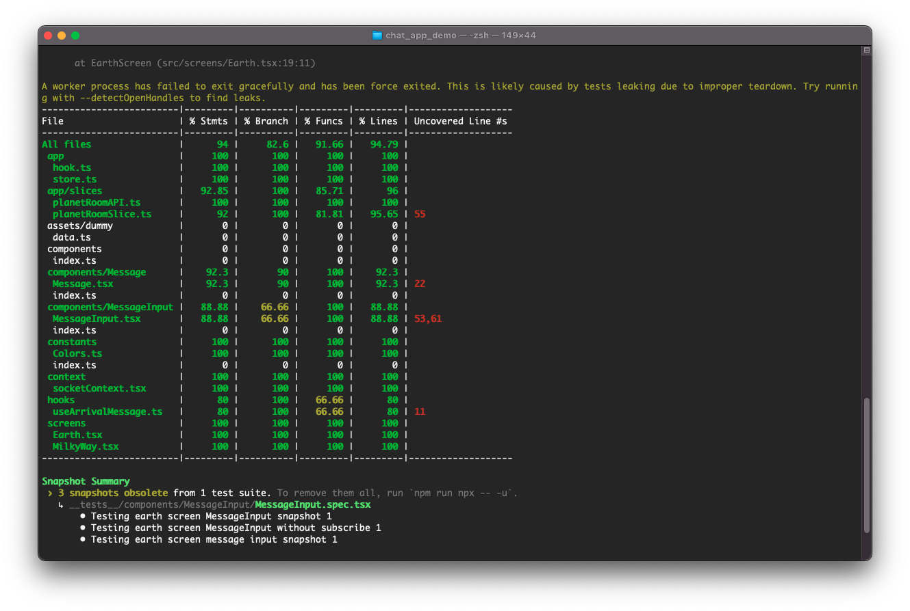

# Getting Started with React Native
---
## Prerequisites

- [Node.js > 12](https://nodejs.org) 
- [Watchman](https://facebook.github.io/watchman)
- [Xcode 12](https://developer.apple.com/xcode)
- [Cocoapods 1.10.1](https://cocoapods.org)
- [JDK > 11](https://www.oracle.com/java/technologies/javase-jdk11-downloads.html)
- [Android Studio and Android SDK](https://developer.android.com/studio)

## Dependencies

- [react-native-config](https://github.com/luggit/react-native-config) to manage envionments.
- [react-navigation](https://reactnavigation.org/) navigation library.
- [redux-toolkit](https://redux-toolkit.js.org/) for state management.
- [redux-thunk](https://github.com/gaearon/redux-thunk) to dispatch asynchronous actions.
- [jest](https://facebook.github.io/jest/) and [react-native-testing-library](https://callstack.github.io/react-native-testing-library/) for testing.
- [socket.io](https://socket.io/docs/v4/) is a library that enables low-latency, bidirectional and event-based communication between a client and a server.

## Start Socket

- You need to go `.env` to replace your IP, then use this command to run socket server: 
##### `cd server && node index.js`

## Available Scripts

In the project directory, you can run:
#### Install dependencies: 
- ##### `npm install`

#### Cocoapods: 
- ##### `cd ios && pod install`
#### Run IOS: 
- ##### `npx react-native run-ios`
#### Run Android: 
- ##### `npx react-native run-android`

## Testing

* ##### `npm test` or `npx jest`
    * options: `--coverage`

